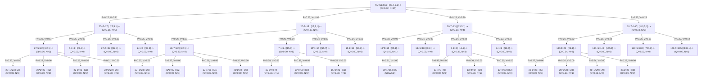

# MCTS Backtracking Trace on Hard Instance

**Problem:** `TARGET:65 | [20,7,5,1] ->`

```mermaid
graph TD
    N0["TARGET:65 | [20,7,5,1] -><br/>(Q=0.32, N=15)"]
    N1["20+7=27 | [27,5,1] -><br/>(Q=0.06, N=2)"]
    N2["27-5=22 | [22,1] -><br/>(Q=0.06, N=2)"]
    N3["22+1=23 | [23] <EOS><br/>(Q=0.00, N=1)"]
    N2 -->|"P=0.27, V=0.00"| N3
    N4["22*1=22 | [22] <EOS><br/>(Q=0.00, N=0)"]
    N2 -->|"P=0.27, V=0.00"| N4
    N5["22-1=21 | [21] <EOS><br/>(Q=0.00, N=0)"]
    N2 -->|"P=0.26, V=0.00"| N5
    N6["22/1=22 | [22] <EOS><br/>(Q=0.00, N=0)"]
    N2 -->|"P=0.21, V=0.00"| N6
    N1 -->|"P=0.26, V=0.11"| N2
    N7["5-1=4 | [27,4] -><br/>(Q=0.00, N=0)"]
    N1 -->|"P=0.25, V=0.09"| N7
    N8["27+5=32 | [32,1] -><br/>(Q=0.00, N=0)"]
    N1 -->|"P=0.25, V=0.11"| N8
    N9["5+1=6 | [27,6] -><br/>(Q=0.00, N=0)"]
    N1 -->|"P=0.25, V=0.05"| N9
    N0 -->|"P=0.27, V=0.11"| N1
    N10["20-5=15 | [15,7,1] -><br/>(Q=0.40, N=5)"]
    N11["15+7=22 | [22,1] -><br/>(Q=0.33, N=3)"]
    N12["22+1=23 | [23] <EOS><br/>(Q=0.00, N=1)"]
    N11 -->|"P=0.27, V=0.00"| N12
    N13["22*1=22 | [22] <EOS><br/>(Q=0.00, N=1)"]
    N11 -->|"P=0.27, V=0.00"| N13
    N14["22-1=21 | [21] <EOS><br/>(Q=0.00, N=0)"]
    N11 -->|"P=0.26, V=0.00"| N14
    N15["22/1=22 | [22] <EOS><br/>(Q=0.00, N=0)"]
    N11 -->|"P=0.20, V=0.00"| N15
    N10 -->|"P=0.26, V=1.00"| N11
    N16["7-1=6 | [15,6] -><br/>(Q=0.00, N=1)"]
    N17["15-6=9 | [9] <EOS><br/>(Q=0.00, N=1)"]
    N16 -->|"P=0.38, V=0.00"| N17
    N18["15*6=90 | [90] <EOS><br/>(Q=0.00, N=0)"]
    N16 -->|"P=0.37, V=0.00"| N18
    N19["15+6=21 | [21] <EOS><br/>(Q=0.00, N=0)"]
    N16 -->|"P=0.25, V=0.00"| N19
    N10 -->|"P=0.26, V=1.00"| N16
    N20["15*1=15 | [15,7] -><br/>(Q=0.00, N=0)"]
    N10 -->|"P=0.24, V=1.00"| N20
    N21["15-1=14 | [14,7] -><br/>(Q=0.00, N=0)"]
    N10 -->|"P=0.24, V=1.00"| N21
    N0 -->|"P=0.25, V=1.00"| N10
    N22["20-7=13 | [13,5,1] -><br/>(Q=0.50, N=4)"]
    N23["13*5=65 | [65,1] -><br/>(Q=1.00, N=1)"]
    N24["65*1=65 | [65] <EOS><br/>(SOLVED)"]
    N23 -->|"P=0.31, V=1.00"| N24
    N22 -->|"P=0.30, V=0.98"| N23
    N25["13+5=18 | [18,1] -><br/>(Q=0.00, N=0)"]
    N22 -->|"P=0.24, V=0.97"| N25
    N26["5-1=4 | [13,4] -><br/>(Q=0.33, N=3)"]
    N27["13-4=9 | [9] <EOS><br/>(Q=0.00, N=1)"]
    N26 -->|"P=0.40, V=0.00"| N27
    N28["13+4=17 | [17] <EOS><br/>(Q=0.00, N=1)"]
    N26 -->|"P=0.30, V=0.00"| N28
    N29["13*4=52 | [52] <EOS><br/>(Q=0.00, N=0)"]
    N26 -->|"P=0.30, V=0.00"| N29
    N22 -->|"P=0.24, V=0.99"| N26
    N30["5+1=6 | [13,6] -><br/>(Q=0.00, N=0)"]
    N22 -->|"P=0.22, V=0.97"| N30
    N0 -->|"P=0.25, V=0.99"| N22
    N31["20*7=140 | [140,5,1] -><br/>(Q=0.24, N=3)"]
    N32["140/5=28 | [28,1] -><br/>(Q=0.24, N=3)"]
    N33["28-1=27 | [27] <EOS><br/>(Q=0.00, N=1)"]
    N32 -->|"P=0.27, V=0.00"| N33
    N34["28*1=28 | [28] <EOS><br/>(Q=0.00, N=1)"]
    N32 -->|"P=0.26, V=0.00"| N34
    N35["28+1=29 | [29] <EOS><br/>(Q=0.00, N=0)"]
    N32 -->|"P=0.24, V=0.00"| N35
    N36["28/1=28 | [28] <EOS><br/>(Q=0.00, N=0)"]
    N32 -->|"P=0.23, V=0.00"| N36
    N31 -->|"P=0.26, V=0.72"| N32
    N37["140+5=145 | [145,1] -><br/>(Q=0.00, N=0)"]
    N31 -->|"P=0.26, V=0.09"| N37
    N38["140*5=700 | [700,1] -><br/>(Q=0.00, N=0)"]
    N31 -->|"P=0.26, V=0.13"| N38
    N39["140-5=135 | [135,1] -><br/>(Q=0.00, N=0)"]
    N31 -->|"P=0.22, V=0.12"| N39
    N0 -->|"P=0.23, V=0.23"| N31
```
