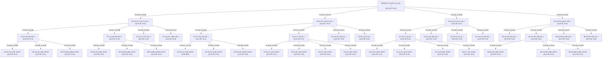

# MCTS Backtracking Trace

**Problem:** `TARGET:14 | [25,12,11,10] ->`

```mermaid
graph TD
    N0["TARGET:14 | [25,12,11,10] -&gt;<br/>(Q=0.36, N=11)"]
    N1["25+12=37 | [37,11,10] -&gt;<br/>(Q=0.23, N=3)"]
    N2["37-11=26 | [26,10] -&gt;<br/>(Q=0.00, N=1)"]
    N3["26-10=16 | [16] &lt;EOS&gt;<br/>(Q=0.00, N=1)"]
    N2 -->|"P=0.55, V=0.00"| N3
    N4["26+10=36 | [36] &lt;EOS&gt;<br/>(Q=0.00, N=0)"]
    N2 -->|"P=0.35, V=0.00"| N4
    N5["26*10=260 | [260] &lt;EOS&gt;<br/>(Q=0.00, N=0)"]
    N2 -->|"P=0.10, V=0.00"| N5
    N1 -->|"P=0.30, V=0.65"| N2
    N6["37+11=48 | [48,10] -&gt;<br/>(Q=0.34, N=2)"]
    N7["48-10=38 | [38] &lt;EOS&gt;<br/>(Q=0.00, N=1)"]
    N6 -->|"P=0.46, V=0.00"| N7
    N8["48+10=58 | [58] &lt;EOS&gt;<br/>(Q=0.00, N=0)"]
    N6 -->|"P=0.40, V=0.00"| N8
    N9["48*10=480 | [480] &lt;EOS&gt;<br/>(Q=0.00, N=0)"]
    N6 -->|"P=0.14, V=0.00"| N9
    N1 -->|"P=0.27, V=0.68"| N6
    N10["37-10=27 | [27,11] -&gt;<br/>(Q=0.00, N=0)"]
    N1 -->|"P=0.24, V=0.62"| N10
    N11["37*11=407 | [407,10] -&gt;<br/>(Q=0.00, N=0)"]
    N1 -->|"P=0.18, V=0.11"| N11
    N0 -->|"P=0.29, V=0.59"| N1
    N12["25-12=13 | [13,11,10] -&gt;<br/>(Q=0.57, N=4)"]
    N13["13+11=24 | [24,10] -&gt;<br/>(Q=1.00, N=1)"]
    N14["24-10=14 | [14] &lt;EOS&gt;<br/>(SOLVED)"]
    N13 -->|"P=0.57, V=1.00"| N14
    N15["24+10=34 | [34] &lt;EOS&gt;<br/>(Q=0.00, N=0)"]
    N13 -->|"P=0.34, V=0.00"| N15
    N16["24*10=240 | [240] &lt;EOS&gt;<br/>(Q=0.00, N=0)"]
    N13 -->|"P=0.09, V=0.00"| N16
    N12 -->|"P=0.34, V=0.52"| N13
    N17["13-11=2 | [10,2] -&gt;<br/>(Q=0.30, N=2)"]
    N18["10+2=12 | [12] &lt;EOS&gt;<br/>(Q=0.00, N=1)"]
    N17 -->|"P=0.40, V=0.00"| N18
    N19["10*2=20 | [20] &lt;EOS&gt;<br/>(Q=0.00, N=0)"]
    N17 -->|"P=0.25, V=0.00"| N19
    N20["10/2=5 | [5] &lt;EOS&gt;<br/>(Q=0.00, N=0)"]
    N17 -->|"P=0.23, V=0.00"| N20
    N21["10-2=8 | [8] &lt;EOS&gt;<br/>(Q=0.00, N=0)"]
    N17 -->|"P=0.12, V=0.00"| N21
    N12 -->|"P=0.24, V=0.59"| N17
    N22["13+10=23 | [23,11] -&gt;<br/>(Q=0.00, N=0)"]
    N12 -->|"P=0.22, V=0.41"| N22
    N23["13-10=3 | [11,3] -&gt;<br/>(Q=0.00, N=0)"]
    N12 -->|"P=0.20, V=0.50"| N23
    N0 -->|"P=0.25, V=0.70"| N12
    N24["25-11=14 | [14,12,10] -&gt;<br/>(Q=0.26, N=2)"]
    N25["12-10=2 | [14,2] -&gt;<br/>(Q=0.26, N=2)"]
    N26["14+2=16 | [16] &lt;EOS&gt;<br/>(Q=0.00, N=1)"]
    N25 -->|"P=0.35, V=0.00"| N26
    N27["14-2=12 | [12] &lt;EOS&gt;<br/>(Q=0.00, N=0)"]
    N25 -->|"P=0.31, V=0.00"| N27
    N28["14*2=28 | [28] &lt;EOS&gt;<br/>(Q=0.00, N=0)"]
    N25 -->|"P=0.19, V=0.00"| N28
    N29["14/2=7 | [7] &lt;EOS&gt;<br/>(Q=0.00, N=0)"]
    N25 -->|"P=0.15, V=0.00"| N29
    N24 -->|"P=0.26, V=0.51"| N25
    N30["14+12=26 | [26,10] -&gt;<br/>(Q=0.00, N=0)"]
    N24 -->|"P=0.25, V=0.43"| N30
    N31["14-10=4 | [12,4] -&gt;<br/>(Q=0.00, N=0)"]
    N24 -->|"P=0.25, V=0.38"| N31
    N32["14+10=24 | [24,12] -&gt;<br/>(Q=0.00, N=0)"]
    N24 -->|"P=0.24, V=0.50"| N32
    N0 -->|"P=0.24, V=0.66"| N24
    N33["25+11=36 | [36,12,10] -&gt;<br/>(Q=0.26, N=2)"]
    N34["36-12=24 | [24,10] -&gt;<br/>(Q=0.00, N=0)"]
    N33 -->|"P=0.31, V=0.50"| N34
    N35["36+12=48 | [48,10] -&gt;<br/>(Q=0.26, N=2)"]
    N36["48-10=38 | [38] &lt;EOS&gt;<br/>(Q=0.00, N=1)"]
    N35 -->|"P=0.46, V=0.00"| N36
    N37["48+10=58 | [58] &lt;EOS&gt;<br/>(Q=0.00, N=0)"]
    N35 -->|"P=0.40, V=0.00"| N37
    N38["48*10=480 | [480] &lt;EOS&gt;<br/>(Q=0.00, N=0)"]
    N35 -->|"P=0.14, V=0.00"| N38
    N33 -->|"P=0.24, V=0.53"| N35
    N39["36*12=432 | [432,10] -&gt;<br/>(Q=0.00, N=0)"]
    N33 -->|"P=0.23, V=0.07"| N39
    N40["36-10=26 | [26,12] -&gt;<br/>(Q=0.00, N=0)"]
    N33 -->|"P=0.22, V=0.52"| N40
    N0 -->|"P=0.23, V=0.59"| N33
```
